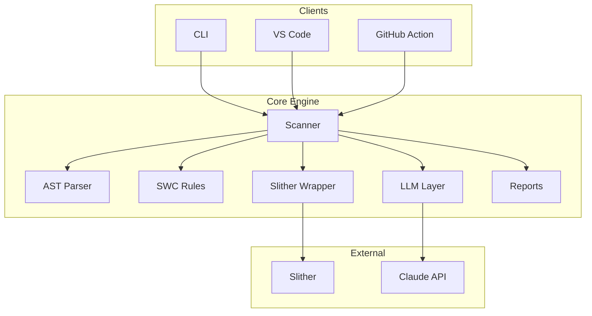
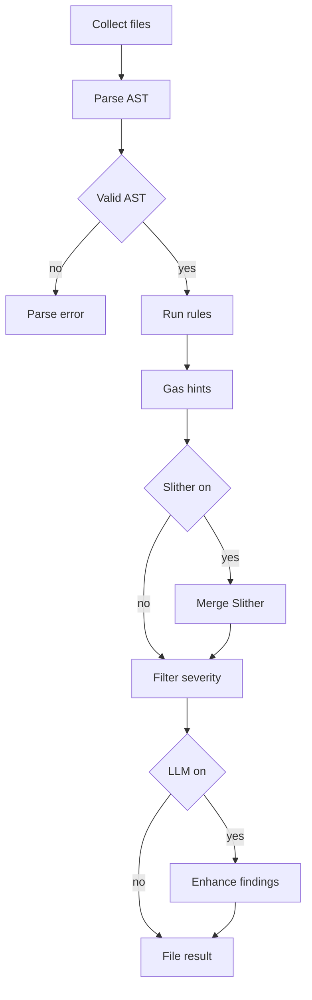
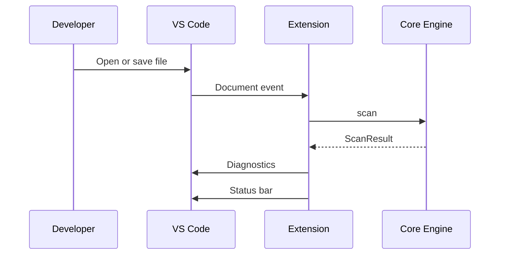
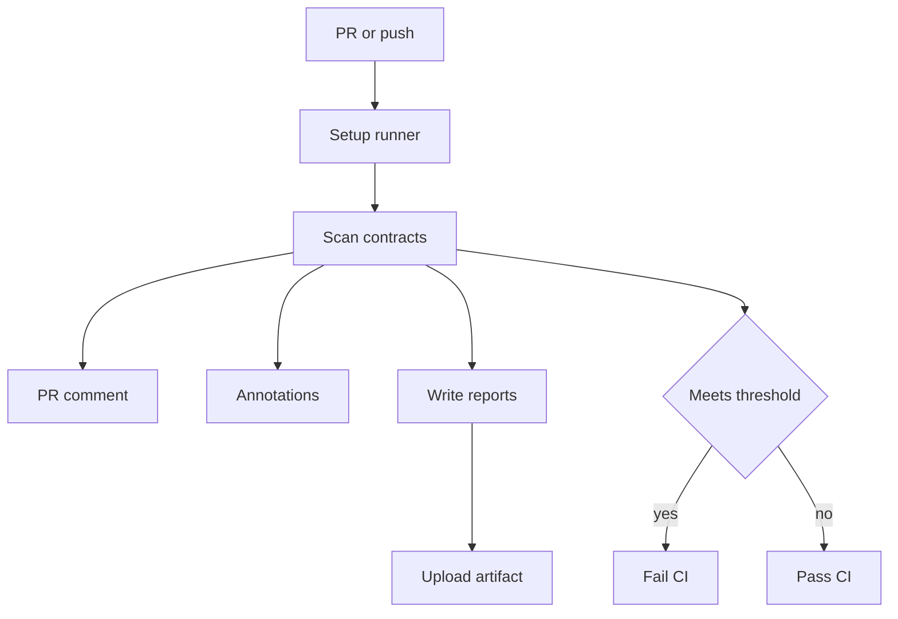
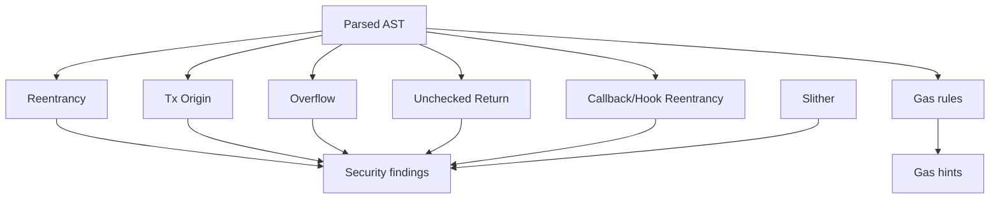

# ChainProof Documentation

**Smart Contract Audit Copilot** — real-time vulnerability scanner, gas advisor, and audit report generator for Solidity.

---

## Table of Contents

- [Overview](#overview)
- [Architecture](#architecture)
- [Scan Pipeline](#scan-pipeline)
- [Repository Layout](#repository-layout)
- [Installation](#installation)
- [CLI Reference](#cli-reference)
- [Governance Safety Analysis](#governance-safety-analysis)
- [Invariant DSL](#invariant-dsl)
- [Staking Accounting](#staking-accounting)
- [Detector Benchmark & Regression Framework](#detector-benchmark--regression-framework)
- [VS Code Extension](#vs-code-extension)
- [GitHub Action](#github-action)
- [Vulnerability Rules](#vulnerability-rules)
- [Data Model](#data-model)
- [Configuration](#configuration)
- [Plugin API](#plugin-api)
- [API Reference](#api-reference)
- [Development Guide](#development-guide)
- [Roadmap](#roadmap)
- [Changelog](#changelog)
- [License](#license)

---

## Overview

ChainProof helps developers catch smart contract vulnerabilities early — in the editor, terminal, and CI pipeline — without waiting weeks or paying tens of thousands for a full audit.

| Problem                                  | ChainProof response                                 |
| ---------------------------------------- | --------------------------------------------------- |
| $1.8B+ lost to exploits in 2023          | Built-in SWC-aligned detectors + optional Slither   |
| 6-week audit queues at $30k–$100k        | Instant scans on every save and PR                  |
| No tooling for indie devs and small DAOs | Free, open-source CLI, extension, and GitHub Action |

### What ChainProof does

- Parses Solidity source into an AST and runs custom vulnerability rules
- Optionally integrates [Slither](https://github.com/crytic/slither) for broader static analysis
- Flags gas optimization opportunities separately from security findings
- Optionally sends critical/high findings to Claude for contextual explanations and fixes
- Emits reports as terminal tables, JSON, or Markdown

> **Disclaimer:** ChainProof is a developer tool, not a substitute for a professional security audit. Always have critical contracts reviewed by qualified humans before mainnet deployment.

---

## Architecture

All user-facing packages share a single scanning engine (`@chainproof/core`). Every interface calls the same `scan()` function with a `ScanConfig` object.



### Package responsibilities

| Package                     | NPM name            | Purpose                                                           |
| --------------------------- | ------------------- | ----------------------------------------------------------------- |
| `packages/core`             | `@chainproof/core`  | AST parsing, rules, Slither wrapper, LLM layer, report generation |
| `packages/cli`              | `@chainproof/cli`   | Command-line interface (`scan`, `check`, `init`)                  |
| `packages/vscode-extension` | `chainproof-vscode` | Inline diagnostics, auto-scan on save, audit report command       |
| `packages/github-action`    | —                   | CI gate, PR comments, workflow annotations, artifacts             |

---

## Scan Pipeline

Each `.sol` file passes through the pipeline below. Directory targets are expanded recursively before scanning.



### Severity levels

Findings are ranked for filtering and CI gating:

| Severity   | Rank | Typical use                                       |
| ---------- | ---- | ------------------------------------------------- |
| `critical` | 5    | Immediate blocker — e.g. reentrancy               |
| `high`     | 4    | Must fix before deploy — e.g. `tx.origin` auth    |
| `medium`   | 3    | Should review — e.g. unchecked return values      |
| `low`      | 2    | Minor issues                                      |
| `info`     | 1    | Informational notes                               |
| `gas`      | 0    | Optimization hints (not security vulnerabilities) |

---

## Repository Layout

```
chainproof/
├── packages/
│   ├── core/
│   │   └── src/
│   │       ├── ast/          # Solidity parser + Slither wrapper
│   │       ├── rules/        # SWC vulnerability detectors + gas optimizer
│   │       ├── llm/          # Claude-powered explanation layer
│   │       ├── report/       # Markdown / JSON / table generators
│   │       ├── scanner.ts    # Main scan orchestrator
│   │       └── types.ts      # Shared TypeScript interfaces
│   ├── cli/                  # `chainproof` CLI
│   ├── vscode-extension/     # VS Code extension
│   └── github-action/        # GitHub Action for CI/CD
├── examples/
│   └── contracts/
│       ├── VulnerableVault.sol   # Intentionally vulnerable (test target)
│       └── SecureVault.sol       # Patched reference implementation
└── .github/workflows/audit.yml   # Example CI workflow
```

---

## Installation

### Prerequisites

| Tool               | Version | Required for                        |
| ------------------ | ------- | ----------------------------------- |
| Node.js            | ≥ 18    | CLI, extension, core engine         |
| Python             | ≥ 3.10  | Slither (optional)                  |
| `slither-analyzer` | latest  | Extended static analysis (optional) |

```bash
# Optional but recommended
pip install slither-analyzer
```

### From source (development)

```bash
git clone https://github.com/your-org/chainproof
cd chainproof
npm install          # installs all workspaces
npm run build        # compiles TypeScript in all packages
```

### Global CLI install

```bash
npm install -g @chainproof/cli
```

---

## CLI Reference

### `chainproof scan`

Scan one or more `.sol` files or directories.

```bash
chainproof scan contracts/
chainproof scan contracts/ --format markdown --output audit.md
chainproof scan contracts/ --api-key YOUR_ANTHROPIC_KEY
chainproof scan contracts/ --min-severity high --no-slither
```

| Flag                     | Default              | Description                            |
| ------------------------ | -------------------- | -------------------------------------- |
| `--no-slither`           | Slither on           | Skip Slither even if installed         |
| `--no-llm`               | LLM on if key set    | Skip Claude enhancement                |
| `--api-key <key>`        | `$ANTHROPIC_API_KEY` | Anthropic API key                      |
| `--min-severity <level>` | `low`                | Filter findings below this level       |
| `--format <format>`      | `table`              | Output: `table`, `json`, or `markdown` |
| `--output <file>`        | stdout               | Write report to file                   |

**Exit codes:** `0` if no critical/high findings; `1` if critical or high issues are detected.

When using the default `table` format without `--output`, a full Markdown report is also saved to `chainproof-report.md`.

### `chainproof benchmark`

Run versioned detector benchmarks, evaluate regression gates, validate corpus manifests, and scaffold new manifests:

```bash
chainproof benchmark run examples/benchmark-corpus/corpus.manifest.json
chainproof benchmark compare baseline.json candidate.json --max-prec-drop 0.02
chainproof benchmark validate corpus.manifest.json
chainproof benchmark init corpus.manifest.json
```

See [Detector Benchmark & Regression Framework](#detector-benchmark--regression-framework) for details.

### `chainproof check`

Fast pass/fail check for CI. Only reports critical and high findings. LLM is always disabled.

```bash
chainproof check contracts/
```

Exits `1` on any critical or high severity finding.

### `chainproof watch`

Long-running watch mode for sub-second local feedback while editing Solidity files. Re-scans only the changed file and its import-graph neighbors (files that import it or are imported by it), reusing the AST cache for everything else.

```bash
chainproof watch contracts/
chainproof watch contracts/Vault.sol --debounce 500
chainproof watch contracts/ --verbose
chainproof watch contracts/ --once
```

| Flag                     | Default              | Description                                              |
| ------------------------ | -------------------- | -------------------------------------------------------- |
| `--no-slither`           | Slither on           | Skip Slither even if installed                           |
| `--no-llm`               | LLM on if key set    | Skip Claude enhancement                                  |
| `--no-metrics`           | Metrics on           | Skip complexity/maintainability metrics                  |
| `--api-key <key>`        | `$ANTHROPIC_API_KEY` | Anthropic API key                                        |
| `--min-severity <level>` | `low`                | Filter findings below this level                         |
| `--plugin <plugin>`      | from config          | Load a custom plugin (repeatable)                        |
| `--debounce <ms>`        | `300`                | Debounce window for save events before re-scanning       |
| `--verbose`              | off                  | Append scrollback output instead of live in-place UI     |
| `--once`                 | off                  | Single scan then exit (same output/exit codes as `scan`) |

**Behavior:** When stdout is a TTY, watch refreshes an in-place summary (severity counts and recent findings). When piped or in CI, output is plain sequential text. Press Ctrl+C to exit cleanly.

**Exit codes:** Same as `scan` — `0` if no critical/high findings; `1` if critical or high issues are detected. With `--once`, behavior matches `chainproof scan` exactly.

Respects `.chainproofrc.json` for plugins the same way `scan` does.

### `chainproof init`

Creates a `.chainproofrc.json` config file in the current directory.

```bash
chainproof init
```

### `chainproof threat-model`

Automatically generates a comprehensive threat model for the target smart contracts, detailing identified assets, actors, trust boundaries, public entry points, and prioritized security threats (with STRIDE and DeFi classifications).

```bash
chainproof threat-model contracts/
chainproof threat-model contracts/Vault.sol --format json --output threat-model.json
chainproof threat-model contracts/ --assumptions assumptions.json --min-severity high
```

| Flag | Default | Description |
| --- | --- | --- |
| `--assumptions <file>` | none | JSON file containing user-provided overrides/mitigations |
| `--min-severity <level>` | `low` | Filter prioritized threats below this level (critical\|high\|medium\|low) |
| `--format <format>` | `markdown` | Output format: `markdown` or `json` |
| `--output <file>` | stdout | Write threat model report to file |

### `chainproof invariants`

Deterministic security invariant specification and checking DSL — see [Invariant DSL](#invariant-dsl) below for the full spec format and semantics.

```bash
chainproof invariants init vault.cpinv.json --contract Vault
chainproof invariants validate vault.cpinv.json
chainproof invariants check vault.cpinv.json contracts/Vault.sol --format json
chainproof invariants explain vault.cpinv.json VAULT-ACCESS-001
chainproof invariants migrate legacy-spec.json --output vault.cpinv.json
```

| Subcommand | Description |
| --- | --- |
| `init <specFile>` | Scaffold a starter spec (`--contract <name>`, `--force`) |
| `validate <specFile>` | Parse + schema/type-check a spec without checking any contract (`--format table\|json`) |
| `check <specFile> <targets...>` | Evaluate a spec against `.sol` targets (`--format`, `--output`, `--max-steps`, `--max-time-ms`) |
| `explain <specFile> <id>` | Print an invariant's resolved scope, expanded condition, and assumptions |
| `migrate <specFile>` | Upgrade a spec to the current schema version (`--write`, `--output <file>`) |

`check` exits `1` if any invariant `fail`s or `error`s, `0` otherwise (`timeout`/`skipped` do not fail the build by themselves — inspect `bounded.timeExceeded`/`stepsExceededIds` in `--format json` output).

### `chainproof governance`

Run the bounded governance, timelock, multisig, and cross-chain proposal safety analyzer:

```bash
chainproof governance contracts/ --format markdown --output governance-report.md
chainproof governance contracts/Governor.sol --format json --fail-on high
chainproof governance contracts/ --include-rule CP-GOV-001 --include-rule CP-GOV-002
chainproof governance contracts/ --config governance.config.json --include-models
```

The command emits deterministic, schema-versioned JSON or Markdown. `--fail-on` accepts
`none|info|low|medium|high|critical`; the default is `high`. Rule include/exclude flags are
repeatable, and bounded-analysis flags limit sources, files, contracts, functions, operations,
evidence, and findings. See [Governance Safety Analysis](#governance-safety-analysis).

---

## Governance Safety Analysis

The specialized engine in `packages/core/src/governance/` builds a normalized state-transition
model for proposal creation, checkpointed voting, quorum math, queue/schedule, timelock delay,
cancel, execute, multisig signature validation, emergency authority, upgrades, and cross-chain
message delivery. It traces proposal-controlled target/value/calldata into privileged calls and
checks guards and state writes in source order.

It recognizes OpenZeppelin Governor and TimelockController shapes, Compound Governor Bravo,
Safe-style threshold multisigs, cross-chain governors, and generic checkpoint/timelock patterns.
The ordinary `chainproof scan` pipeline also runs these rules once per physical Solidity file.

```typescript
import {
  analyzeGovernanceFiles,
  serializeGovernanceReport,
} from '@chainproof/core';

const report = analyzeGovernanceFiles(['contracts/'], {
  includeModels: true,
  limits: { maxFindings: 200 },
  excludeRules: ['CP-GOV-009'],
});
process.stdout.write(serializeGovernanceReport(report));
```

Reports describe structural implementation safety only. They do not judge voter preferences,
political legitimacy, or whether a proposal's outcome is desirable. Full rule semantics,
configuration schema, threat model, limitations, and troubleshooting are documented in
**[docs/governance-safety.md](docs/governance-safety.md)**. Secure/vulnerable fixtures live under
[`examples/contracts/governance/`](examples/contracts/governance/SecureGovernor.sol).

---

## Staking Accounting

Run the dedicated deterministic analysis for stake shares, accumulated reward
indexes, epochs, fee-on-transfer/rebasing assets, emergency exits, reward-token
recovery, and vesting cliffs:

```bash
chainproof staking contracts/ --format markdown --output staking-report.md
chainproof staking contracts/ --format json --fail-on none
```

The output uses schema `1.0.0` and includes precise source locations, ordered
evidence, assumptions, and confidence. It has no live-network dependency and
does not estimate investment yield. See
[the staking accounting guide](docs/staking-accounting.md) for APIs, rules,
configuration migration, threat model, resource limits, compatibility, fixture
coverage, rule-author guidance, and troubleshooting.

---

## Detector Benchmark & Regression Framework

Run versioned benchmark evaluations against standardized detector corpus manifests, measuring precision, recall, F1/F2/F0.5 scores, per-rule coverage, runtime latency, and peak memory, while enforcing precision regression gates:

```bash
chainproof benchmark run examples/benchmark-corpus/corpus.manifest.json --format markdown --output benchmark-report.md
chainproof benchmark compare baseline.json candidate.json --min-precision 0.85 --max-prec-drop 0.02
```

See **[docs/benchmark-framework.md](docs/benchmark-framework.md)** for full details on corpus manifest schemas, assertions, fixture mutations, sharding, deterministic sampling, and CI comparison gates.

---

## Invariant DSL

A versioned, declarative JSON DSL (`packages/core/src/dsl/`, exported from `@chainproof/core`) for expressing protocol-specific security invariants — access control, state, arithmetic, call ordering, events, value-flow, and cross-function properties — that generic detectors can't know about, and checking them deterministically against Solidity source via bounded AST/call-graph queries (never a live network, and never a symbolic executor or SMT solver).

```typescript
import { parseInvariantSpecFile, checkInvariants } from '@chainproof/core';

const { spec, diagnostics } = parseInvariantSpecFile('vault.cpinv.json');
if (spec) {
  const report = await checkInvariants(spec, { targets: ['contracts/Vault.sol'] });
  console.log(report.summary); // { pass, fail, error, timeout, skipped, total }
}
```

See **[docs/invariant-dsl.md](docs/invariant-dsl.md)** for the full spec format, the condition expression grammar, semantics of each invariant kind, the diagnostic code reference, the threat model/limitations, and troubleshooting. Working examples live in [`examples/invariant-specs/vault.cpinv.json`](examples/invariant-specs/vault.cpinv.json) checked against the secure/vulnerable fixture pair, [`SecureVaultInvariants.sol`](examples/contracts/invariants/SecureVaultInvariants.sol) and [`VulnerableVaultInvariants.sol`](examples/contracts/invariants/VulnerableVaultInvariants.sol).

---

## VS Code Extension

Install from the VS Code Marketplace (search **ChainProof**) or load from `packages/vscode-extension` during development.

### Commands

| Command                             | Description                        |
| ----------------------------------- | ---------------------------------- |
| `ChainProof: Scan Current File`     | Scan the active `.sol` file        |
| `ChainProof: Scan Entire Workspace` | Scan all open Solidity files       |
| `ChainProof: Generate Audit Report` | Write `chainproof-audit-report.md` |
| `ChainProof: Clear Diagnostics`     | Remove all ChainProof diagnostics  |

### Behavior



Findings appear in the **Problems** panel with severity mapped to VS Code diagnostic levels:

- `critical` / `high` → Error
- `medium` → Warning
- `low` / `info` / `gas` → Information or Hint

### Settings

Configure under **Settings → ChainProof**:

| Setting                   | Default | Description                                    |
| ------------------------- | ------- | ---------------------------------------------- |
| `chainproof.enableOnSave` | `true`  | Auto-scan on save                              |
| `chainproof.useSlither`   | `true`  | Run Slither if available                       |
| `chainproof.useLLM`       | `false` | Enhance findings with Claude                   |
| `chainproof.apiKey`       | `""`    | Anthropic API key (or `ANTHROPIC_API_KEY` env) |
| `chainproof.minSeverity`  | `low`   | Minimum severity to display                    |

---

## GitHub Action

Add ChainProof to your workflow to gate merges on security findings.

```yaml
# .github/workflows/audit.yml
- name: ChainProof Audit
  uses: your-org/chainproof@v1
  with:
    targets: "contracts/"
    min-severity: "high"
    use-slither: "true"
    api-key: ${{ secrets.ANTHROPIC_API_KEY }}
  env:
    GITHUB_TOKEN: ${{ secrets.GITHUB_TOKEN }}
```

### Action inputs

| Input           | Default      | Description                            |
| --------------- | ------------ | -------------------------------------- |
| `targets`       | `contracts/` | Space-separated paths to scan          |
| `min-severity`  | `high`       | Fail CI at this severity or above      |
| `use-slither`   | `true`       | Run Slither if installed on runner     |
| `api-key`       | `""`         | Anthropic API key for LLM enhancement  |
| `report-format` | `markdown`   | PR comment format                      |
| `upload-report` | `true`       | Write reports to `chainproof-reports/` |
| `fail-on-gas`   | `false`      | Fail CI when gas hints are present     |

### Action outputs

| Output           | Description                        |
| ---------------- | ---------------------------------- |
| `critical-count` | Number of critical findings        |
| `high-count`     | Number of high findings            |
| `total-count`    | Total findings including gas hints |
| `report-path`    | Path to generated Markdown report  |

### CI workflow



The action will:

- Scan all `.sol` files under `targets`
- Post or update a summary comment on pull requests
- Annotate changed files with inline findings
- Upload the full audit report as a GitHub Actions artifact
- Fail the job when findings meet or exceed `min-severity`

See [`.github/workflows/audit.yml`](.github/workflows/audit.yml) for a complete working example.

---

## Vulnerability Rules

### Built-in detectors

| ID     | SWC                                            | Name                         | Severity | Detection approach                                 |
| ------ | ---------------------------------------------- | ---------------------------- | -------- | -------------------------------------------------- |
| CP-107 | [SWC-107](https://swcregistry.io/docs/SWC-107) | Reentrancy                   | Critical | External call before state update in same function |
| CP-115 | [SWC-115](https://swcregistry.io/docs/SWC-115) | `tx.origin` authentication   | High     | `tx.origin` used in `require` or access control    |
| CP-101 | [SWC-101](https://swcregistry.io/docs/SWC-101) | Integer overflow / underflow | High     | Arithmetic on pragma `< 0.8` without SafeMath      |
| CP-104 | [SWC-104](https://swcregistry.io/docs/SWC-104) | Unchecked call return value  | Medium   | `.call` / `.send` return value not checked         |
| CP-122 | —                                              | Vault share-price inflation  | High     | Live-balance share ratio without initialization protection |
| CP-CB-CEI | —                                           | Incomplete state before a standards-driven callback | Critical | ERC-721/1155/777/3156 hook fired with state left unfinalized |
| CP-CB-CROSSFN | —                                       | Cross-function reentrancy via callback | Critical | Sibling function touches state left stale across the callback |
| CP-CB-READONLY | —                                      | Read-only reentrancy via callback | High     | `view` function exposes a value finalized only after the callback |
| CP-CB-SPOOF | —                                         | Callback spoofing | High     | Receiver-hook function mutates state with no `msg.sender` check |
| CP-CB-BATCH | —                                         | Unbounded batch callback | Medium   | Callback fired once per loop iteration with no length cap |
| GAS-\* | —                                              | Gas optimizations            | Gas      | Storage in loops, packing, `keccak256`, etc.       |

When Slither is installed, all [Slither detectors](https://github.com/crytic/slither/wiki/Detector-Documentation) are merged in with deduplication by line + title. Slither findings are prefixed with `SLITHER-`.

See [Callback, Hook & Reentrancy Analysis](#callback-hook--reentrancy-analysis-cp-90) below for what `CP-CB-*` covers, how it recognizes guards, and its known limitations.

### Rule detection flow



### Example contracts

`examples/contracts/VulnerableVault.sol` is intentionally vulnerable and should report critical + high findings. `SecureVault.sol` is the patched reference and should scan clean.

```bash
# After building from source
node packages/cli/dist/cli.js scan examples/contracts/VulnerableVault.sol
node packages/cli/dist/cli.js scan examples/contracts/SecureVault.sol
```

### Callback, Hook & Reentrancy Analysis (CP-90)

`packages/core/src/rules/callback-analysis/` models the **implicit control-flow
edges** that ERC-721/ERC-1155/ERC-777 receiver and sender hooks, ERC-3156-style
flash-loan callbacks, and project-defined callback registries introduce — call
paths that plain external-call detection (`CP-107` / `CP-107-X`) doesn't see
because there is no literal `.call{value: ...}("")` in the vulnerable function.

**Threat model.** Any address a contract mints/transfers/lends to under one of
these standards is assumed untrusted until proven otherwise (an allowlisted
receiver, an EOA-only check, or a reentrancy guard). The analysis asks: at the
moment control is handed to that address, is any contract state left
unfinalized, and can that address (or a sibling function it can trigger) turn
that window into a real primitive?

**What's modeled** (`callback-graph.ts`, `standards.ts`): direct hook
invocations (`onERC721Received`, `onERC1155Received`/`BatchReceived`,
ERC-777 `tokensReceived`/`tokensToSend`, `onFlashLoan`, `tokenFallback`),
OpenZeppelin-style dispatch helpers (`_checkOnERC721Received`,
`_callTokensToSend`, …) reached indirectly through the function call graph
(up to 3 hops), low-level calls carrying a hook's selector, and custom
callback-registry lookups (`IHook(handlers[token]).onX(...)`). Each edge
records whether it fires once (`isBatch: false`) or once per loop iteration
over a caller-supplied array (`isBatch: true`, plus `isUnboundedBatch` when no
explicit length cap precedes the loop).

**What's detected**, one rule ID per class so findings can be triaged/suppressed independently:

- **`CP-CB-CEI`** — state variables the entry function still writes to at or
  after the callback (same-function Checks-Effects-Interactions violation);
  for flash-callback edges specifically, this fires when no post-callback
  repayment/invariant check is found.
- **`CP-CB-CROSSFN`** — a sibling function reads/writes state the entry
  function read before the callback without having finalized it first.
- **`CP-CB-READONLY`** — a `view` function exposes a value the entry function
  only finalizes *after* the callback — the read-only reentrancy pattern used
  to manipulate on-chain price/exchange-rate consumers.
- **`CP-CB-SPOOF`** — a receiver-hook-shaped function mutates sensitive state
  without checking `msg.sender`, so anyone can call it directly and spoof a
  transfer that never happened.
- **`CP-CB-BATCH`** — a batch callback loop with no explicit
  `require(arr.length <= MAX)` guard (reentrancy surface multiplication +
  gas-griefing DoS).

**Guards recognized** (`guards.ts`), any of which suppresses the
corresponding finding and is instead recorded as an `assumption` on findings
it doesn't fully suppress: a `nonReentrant`-style modifier, a hand-rolled
`require(!locked)` / `locked = true` / `locked = false` mutex, a
trust/allowlist check on the callback target, an EOA-only
(`code.length == 0` / `isContract()`) check, and — for flash-callbacks only —
a post-callback balance-plus-fee invariant check.

**Confidence & evidence.** Every finding carries `confidence` (`high` /
`medium` / `low`) and an `evidence` array citing exactly which signal (a
matched function signature, a low-level selector, a helper-name heuristic,
…) the conclusion rests on, plus `assumptions` for any guard that was
evaluated but didn't fully suppress the finding. `callPath` shows the
concrete call chain from the entry function to the callback (and to the
affected sibling, for `CP-CB-CROSSFN`/`CP-CB-READONLY`).

**Determinism & bounds.** Traversal is a bounded, cycle-safe AST walk (see
`ast-walk.ts`); hitting the traversal budget on a pathological/adversarial
contract surfaces a `CP-CB-TRUNCATED` info-level finding rather than hanging
or silently under-reporting. Given the same input, output is always
byte-identical (findings are sorted by file, line, then rule ID).

**Limitations.** Requires a `MergedContractView` (i.e. runs wherever
`CP-107-X` runs — see [Data Model](#data-model)); CEI/cross-function analysis
is line-based per function rather than a full interprocedural dataflow, so a
helper function that itself performs additional state writes *after* a
further-nested call it makes is not separately modeled beyond the 3-hop
resolution depth. General multi-hop cross-contract reentrancy (tracing state
across separately deployed contracts) is out of scope here and tracked in
issue #66 — this analysis supplies the standards-aware implicit edges and
callback-specific rules that feed into that broader picture.

---

## Data Model

### `Finding`

Each detected issue is a `Finding` object:

```typescript
interface Finding {
  id: string; // e.g. "CP-107"
  title: string;
  description: string;
  recommendation: string;
  severity: "critical" | "high" | "medium" | "low" | "info" | "gas";
  file: string;
  line: number;
  lineEnd?: number;
  snippet?: string;
  swcId?: string; // e.g. "SWC-107"
  llmEnhanced?: boolean;
  callPath?: string[]; // e.g. ["safeMint", "_checkOnERC721Received"]
  evidence?: Array<{ description: string; file?: string; line?: number }>;
  assumptions?: string[];
  confidence?: "high" | "medium" | "low";
}
```

### `ScanResult`

```typescript
interface ScanResult {
  version: string;
  timestamp: string;
  files: FileScanResult[];
  summary: {
    critical: number;
    high: number;
    medium: number;
    low: number;
    info: number;
    gas: number;
    total: number;
  };
}
```

### Programmatic usage

```typescript
import { scan, generateMarkdownReport } from "@chainproof/core";

const result = await scan({
  targets: ["contracts/MyToken.sol"],
  useSlither: true,
  useLLM: false,
  minSeverity: "low",
});

console.log(generateMarkdownReport(result));
```

---

## Configuration

### Environment variables

| Variable            | Used by                | Description                        |
| ------------------- | ---------------------- | ---------------------------------- |
| `ANTHROPIC_API_KEY` | CLI, extension, action | Claude API key for LLM enhancement |

### `.chainproofrc.json`

Generated by `chainproof init`:

```json
{
  "targets": ["contracts/"],
  "useSlither": true,
  "useLLM": true,
  "minSeverity": "low",
  "outputFormat": "markdown",
  "output": "audit-report.md"
}
```

### Slither integration

When `useSlither` is enabled, ChainProof enriches Slither's raw output before
merging it with built-in findings:

- **Detector registry** (`packages/core/src/ast/slither-detectors.ts`) maps
  90+ of Slither's built-in detectors to a human title, an SWC cross-reference
  where one applies, and a rule category used for deduplication. Unmapped
  detectors still produce a finding — just without the extra context.
- **Confidence-weighted severity** — Slither reports both an `impact`
  (High/Medium/Low/Informational) and a `confidence` (High/Medium/Low) for
  every finding. ChainProof combines both axes instead of impact alone, so a
  High-impact/Low-confidence finding reads as `medium`, not `critical`:

  | Impact ↓ / Confidence → | High     | Medium | Low    |
  | ------------------------ | -------- | ------ | ------ |
  | High                     | critical | high   | medium |
  | Medium                   | high     | medium | low    |
  | Low                      | medium   | low    | info   |
  | Informational            | info     | info   | info   |

- **Deduplication** matches on rule category + normalized file + line-range
  overlap, so e.g. built-in `CP-107` and Slither's `reentrancy-eth` firing on
  the same lines collapse into one finding instead of two, and Slither
  reporting the same issue once per inheritance level doesn't produce
  duplicates either.
- **Detector allowlist/denylist** — exclude noisy detectors (or run only a
  specific set) via `ScanConfig.slither.detectors`:

  ```json
  {
    "targets": ["contracts/"],
    "useSlither": true,
    "useLLM": false,
    "slither": {
      "detectors": {
        "exclude": ["assembly", "low-level-calls"]
      }
    }
  }
  ```

  `include` takes precedence over `exclude` when both are set. Omitting
  `slither` entirely runs every detector, matching prior behavior.

### LLM enhancement

When enabled, critical and high findings are sent to Claude (`claude-sonnet-4-20250514`) for:

- A developer-friendly explanation of the risk in context
- A copy-paste-ready fix for the specific code
- A brief real-world exploit scenario

```bash
export ANTHROPIC_API_KEY=sk-ant-...
chainproof scan contracts/ --llm
```

LLM calls are best-effort — if the API fails, the original scanner finding is returned unchanged.

---

## Plugin API

ChainProof is extensible. Teams can ship custom detection rules via plugins without modifying the core engine. Plugins enable:

- **Protocol-specific rules** — Detect usage of non-approved oracle wrappers or deprecated internal functions
- **Proprietary patterns** — Auditing firms can bundle closed-source detection logic
- **Research & prototyping** — Test new vulnerability detectors before contributing to core
- **Team standards** — Enforce internal coding practices across projects

### Plugin structure

A plugin is an NPM package or `.js` file that exports a `ChainProofPlugin` object:

```typescript
interface ChainProofPlugin {
  name: string; // e.g. "myteam-rules"
  version: string; // semantic version
  rules: PluginRule[]; // array of detection rules
}

interface PluginRule {
  id: string; // e.g. "MYTEAM-001"
  title: string; // human-readable title
  severity: Severity; // "critical" | "high" | "medium" | "low" | "info"
  description: string; // why this is dangerous
  recommendation?: string; // how to fix it
  detect: (ast: ASTNode, source: string, filePath: string) => Finding[];
}
```

### Example plugin

See `examples/plugins/simple-rules/index.js` for a complete working example with two simple rules.

**To run the example:**

```bash
# From the root directory
npm run build
chainproof scan examples/contracts/ --plugin examples/plugins/simple-rules/index.js
```

### Loading plugins

Plugins can be loaded in three ways:

#### CLI: `--plugin` flag

```bash
# Load a single plugin
chainproof scan contracts/ --plugin ./my-rules.js

# Load multiple plugins (repeat the flag)
chainproof scan contracts/ --plugin ./my-rules.js --plugin @myteam/chainproof-rules

# Load a plugin via npm package
npm install @myteam/chainproof-rules
chainproof scan contracts/ --plugin @myteam/chainproof-rules
```

#### Config file: `.chainproofrc.json`

Create a `.chainproofrc.json` in your project root:

```json
{
  "targets": ["contracts/"],
  "useSlither": true,
  "useLLM": false,
  "plugins": ["./local-rules/my-plugin.js", "@myteam/chainproof-rules"]
}
```

Then scan automatically picks up the plugins:

```bash
chainproof scan  # plugins from .chainproofrc.json
```

#### Programmatic: `ScanConfig.plugins`

```typescript
import { scan, loadPlugins } from "@chainproof/core";

const plugins = loadPlugins(["@myteam/rules", "./local/rules.js"]);

const result = await scan({
  targets: ["contracts/"],
  useSlither: true,
  plugins,
});
```

### Writing a plugin

**Step 1: Create a `.js` or `.ts` file with a plugin object:**

```javascript
// my-custom-rules.js
const plugin = {
  name: "my-custom-rules",
  version: "1.0.0",
  rules: [
    {
      id: "CUSTOM-001",
      title: "Disallow magic numbers",
      severity: "medium",
      description: "Magic numbers reduce code clarity and maintainability.",
      recommendation: "Define named constants instead.",
      detect(ast, source, filePath) {
        // Return an array of Finding objects
        return [];
      },
    },
  ],
};

module.exports = plugin;
```

**Step 2: Use the visitor pattern to traverse the AST:**

The `ast` parameter is a Solidity AST (from `@solidity-parser/parser`). ChainProof's internal rules use this pattern:

```javascript
detect(ast, source, filePath) {
  const findings = [];

  // Helper to walk the AST
  function visit(node, callback) {
    if (!node) return;
    callback(node);
    for (const key in node) {
      if (Array.isArray(node[key])) {
        node[key].forEach(child => visit(child, callback));
      } else if (typeof node[key] === "object") {
        visit(node[key], callback);
      }
    }
  }

  visit(ast, (node) => {
    if (node.type === "FunctionDefinition") {
      // Detect something about this function
      if (/* your condition */) {
        findings.push({
          id: "CUSTOM-001",
          title: "...",
          severity: "medium",
          description: "...",
          recommendation: "...",
          file: filePath,
          line: node.loc?.start?.line || 0,
          snippet: source.split("\n")[node.loc?.start?.line - 1],
        });
      }
    }
  });

  return findings;
}
```

**Step 3: Publish as an NPM package (optional):**

```bash
npm init -y
npm publish
```

Then users can install and use it:

```bash
npm install @myteam/chainproof-rules
chainproof scan contracts/ --plugin @myteam/chainproof-rules
```

### Plugin error handling

If a plugin fails to load or throws an error during detection:

- The warning is logged to stderr (non-fatal)
- Scanning continues with other rules and plugins
- The scan does not fail

```
[ChainProof] Failed to load plugin "my-plugin.js": Cannot find module
[ChainProof] Plugin "my-rules" rule "CUSTOM-001" failed: TypeError ...
```

This design ensures plugins are optional enhancements, not blockers.

### Plugin types

You can import the plugin types for TypeScript projects:

```typescript
import type {
  ChainProofPlugin,
  PluginRule,
  Finding,
  ASTNode,
  Severity,
} from "@chainproof/core";
```

---

## API Reference

Full generated API documentation for `@chainproof/core` — every public function,
type, and interface with JSDoc descriptions and examples — is published at:

**https://dragoncode-01.github.io/StellarChainproofs/api/**

It is rebuilt automatically from source on every release (see
[`.github/workflows/docs.yml`](.github/workflows/docs.yml)). To build it
locally:

```bash
npm run docs --workspace=packages/core
# open packages/core/../../docs/api/index.html
```

`@chainproof/core`'s exports are split into two tiers:

- **Public, stable** — `scan`, `generateMarkdownReport`, `generateJSONReport`,
  `generateTableReport`, `isSlitherAvailable`, `loadPlugin`, `loadPlugins`,
  `loadConfigFile`, `mergePluginsFromConfig`, and their associated types
  (`ScanConfig`, `ScanResult`, `Finding`, `ChainProofPlugin`, `PluginRule`,
  etc). These follow semantic versioning: breaking changes bump the major
  version, additive changes bump minor, fixes bump patch.
- **Internal** — helpers like `parseSolidity`, `visit`, and `runSlither` are
  tagged `@internal` and excluded from the generated reference. They are
  implementation details of the rule engine and may change without notice
  between minor versions.

Deprecated public APIs are marked with `@deprecated` in a minor release and
removed no earlier than the next major release — see the
[Changelog](#changelog) for specifics.

### Quick start

```typescript
import { scan, generateMarkdownReport } from "@chainproof/core";

const result = await scan({
  targets: ["contracts/"],
  useSlither: false,
  useLLM: false,
  useMetrics: false,
});

console.log(result.summary.critical); // number of critical findings
console.log(generateMarkdownReport(result));
```

See [Programmatic usage](#programmatic-usage) and [Plugin API](#plugin-api)
above for more complete examples, including Slither, LLM enhancement, and
custom rules.

---

## Development Guide

### Build and test

```bash
npm install
npm run build
npm run lint
npm run test
```

### Adding a new rule

1. Create `packages/core/src/rules/swcXXX-your-rule.ts`
2. Export a `detectXxx(ast, source, filePath): Finding[]` function using the AST visitor pattern
3. Import and call it in `packages/core/src/scanner.ts`
4. Add an entry to the [Vulnerability Rules](#vulnerability-rules) table
5. Add or update an example in `examples/contracts/` to exercise the rule

**Rule template:**

```typescript
import { visit, getSnippet } from "../ast/parser";
import type { Finding } from "../types";
import type { ASTNode } from "@solidity-parser/parser";

export function detectMyRule(
  ast: ASTNode,
  source: string,
  filePath: string,
): Finding[] {
  const findings: Finding[] = [];

  visit(ast, {
    // Match relevant AST node types
    FunctionDefinition(node: ASTNode) {
      // ... detection logic ...
      findings.push({
        id: "CP-XXX",
        swcId: "SWC-XXX",
        title: "Rule title",
        description: "Why this is dangerous",
        recommendation: "How to fix it",
        severity: "high",
        file: filePath,
        line: 0,
        snippet: getSnippet(source, node),
      });
    },
  });

  return findings;
}
```

### Workspace scripts

| Script            | Description                        |
| ----------------- | ---------------------------------- |
| `npm run build`   | Build all packages                 |
| `npm run test`    | Run tests in all workspaces        |
| `npm run lint`    | ESLint on `packages/*/src/**/*.ts` |
| `npm run dev:cli` | Watch-build the CLI package        |

---

## Roadmap

- [ ] SWC-103: Floating pragma detector
- [ ] SWC-116: Timestamp dependency
- [ ] SWC-120: Weak randomness (`block.timestamp` / `blockhash`)
- [ ] Foundry test generation for detected vulnerabilities
- [ ] Hardhat plugin
- [ ] SARIF output for GitHub Security tab
- [ ] Web dashboard with project-level history
- [ ] Support for Vyper

---

## Changelog

See [CHANGELOG.md](CHANGELOG.md) for the full release history. This project
follows [Keep a Changelog](https://keepachangelog.com/en/1.1.0/) and
[Semantic Versioning](https://semver.org/spec/v2.0.0.html).

---

## License

MIT © ChainProof Contributors
